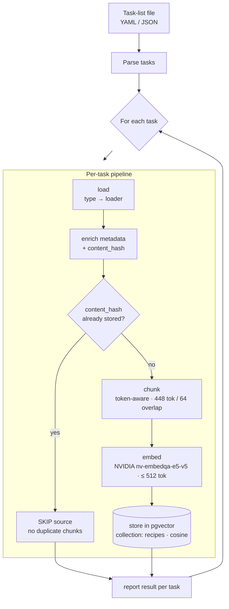

# MealMate AI

A learning spike to explore LLM integration, RAG pipelines, AI agents, and conversational UIs. The project builds a recipe assistant chatbot that ingests content from YouTube videos, PDFs, and websites, stores it as vector embeddings, and uses retrieval-augmented generation to answer cooking questions.

Not production code — just a playground to get hands-on with the AI toolchain.

## Tech Stack

- Python 3.12+ / uv
- LangChain + NVIDIA Build API (free tier)
- PostgreSQL + pgvector
- Streamlit
- Docker Compose

## Getting Started

```bash
# 1. Start the database
docker compose -f deploy/docker-compose.yml up -d

# 2. Install dependencies
uv sync

# 3. Configure environment
cp .env.example .env
# Edit .env and add your NVIDIA API key (MEALMATE_NVIDIA_API_KEY)

# 4. Ingest some content (reads a task-list file — see "Ingestion Pipeline" below)
uv run python -m src.worker.cli ingest --tasks examples/ingest-tasks.example.yaml

# 5. Launch the chat UI
uv run streamlit run src/web/app.py
```

## API Key Setup

The chat interface requires a free NVIDIA Build API key to call the LLM.

1. Go to [build.nvidia.com](https://build.nvidia.com) and create a free account.
2. Generate an API key — it starts with `nvapi-`.
3. Copy the environment template and add your key:

   ```bash
   cp .env.example .env
   # Then open .env and set:
   # MEALMATE_NVIDIA_API_KEY=nvapi-<your-key-here>
   ```

**Key variables:**

| Variable | Required for | Notes |
|----------|-------------|-------|
| `MEALMATE_NVIDIA_API_KEY` | Chat (required) | Free tier at build.nvidia.com |
| `MEALMATE_NVIDIA_MODEL` | Chat (optional) | Defaults to `meta/llama-3.1-8b-instruct` |
| `MEALMATE_NVIDIA_EMBED_MODEL` | Ingestion only | Not needed for chat |
| `MEALMATE_DB_URL` | Ingestion only | Not needed for chat |

> **Note:** You can run the chat UI without a database. A database is only needed for
> the ingestion pipeline (`uv run python -m src.worker.cli ingest ...`). If the API key
> is missing or invalid, the app shows a friendly error message instead of crashing.

## Ingestion Pipeline

The worker is a manually-run CLI that loads content into the vector store so the chat
assistant can retrieve it. You point it at a **task-list file** and it processes each
entry through one pipeline:



### Run it

```bash
# The database must be running first (step 1 in Getting Started).
uv run python -m src.worker.cli ingest --tasks examples/ingest-tasks.example.yaml
```

`--tasks` takes a YAML **or** JSON file. Each entry is `{ type, source, metadata? }`:

```yaml
- type: pdf                       # "pdf" is implemented; "youtube"/"web" are reserved (not yet)
  source: docs/sample-recipe.pdf  # file path or URL
  metadata:
    cuisine: italian              # optional, merged into every stored chunk
```

A copy you can edit lives at `examples/ingest-tasks.example.yaml` (and `.json`).

Tasks are processed independently: **one failing task is reported and the run
continues** with the rest. The CLI exits non-zero if any task failed.

### What each stage does

| Stage | What happens |
|-------|--------------|
| **load** | The source `type` routes to a loader (`pdf` → PyPDFLoader). Returns raw `Document`s. |
| **enrich** | Attaches normalized metadata to every chunk: `source_url`, `source_type`, `title`, `chunk_index`, and a per-source `content_hash` (SHA-256 of the normalized text). |
| **dedup** | If the `content_hash` already exists in the store, the source is **skipped** — re-ingesting the same unchanged file does not create duplicate chunks. |
| **chunk** | The text is split into smaller pieces (see below). |
| **embed + store** | Each chunk is embedded via the NVIDIA API and written to pgvector (collection `recipes`, cosine distance). |

### Why chunk the text?

RAG retrieves by **whole chunks**, so chunk size sets two things at once:

1. **Retrieval granularity** — a chunk is the smallest unit the assistant can pull back.
   Too large and retrieval drags in irrelevant text; too small and it loses context.
2. **A hard model limit** — the embedding model (`nvidia/nv-embedqa-e5-v5`) rejects any
   input over **512 tokens** with a `400` error. A whole PDF page easily exceeds that.

So the pipeline splits **token-aware** (via tiktoken) into chunks of **448 tokens** with a
**64-token overlap** — comfortably under the 512 limit, with the overlap preserving context
across boundaries. The rationale and the bug that motivated it are recorded in
[ADR-005](docs/decisions/005-chunking-strategy.md). Chunk sizing is a deliberate decision —
don't change it without reading that ADR.

> **Requires:** the database running (`docker compose -f deploy/docker-compose.yml up -d`)
> and `MEALMATE_NVIDIA_API_KEY` set — ingestion calls the real embeddings API. In VS Code,
> the `Worker: ingest` launch configs start the database automatically (see `.vscode/`).

## Running Tests

Coverage is enforced at 80% minimum (`--cov-fail-under=80`, configured in `pyproject.toml`).

```bash
uv run pytest                   # All tests (with coverage)
uv run pytest tests/unit/       # Unit only
uv run pytest tests/integration # Integration (uses Testcontainers)
uv run pytest --no-cov          # Skip coverage
```

## Linting

```bash
uv run ruff check .             # Lint
uv run ruff format .            # Format
```
